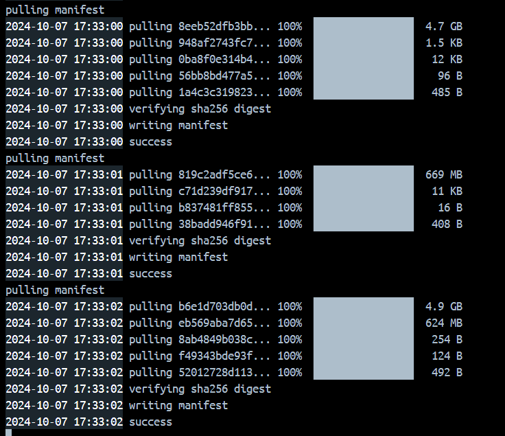

# AI-RAG-Ollama

Welcome to the **AI-RAG-Ollama** repository. This project uses open source models from ollama and whisper to create a conversational AI that can be used to generate answers based on the provided files. The project is built using FastApi (Python) and VueJS (Frontend), and can be run locally on your machine.

## 🎯 Prerequisites

Ensure you have Docker installed on your system. You can download **[Docker Desktop](https://www.docker.com/products/docker-desktop)** for your platform. Once Docker is running, follow the steps below to set up and run the project.

## 🚀 Quick Start

### Step 1: Build the Whisper Base Image

1. Open your terminal (in Visual Studio Code which is easier).
2. Navigate to the Backend directory/folder where `Dockerfile.whisper` is located. Use ```cd ./Backend``` to navigate to the backend directory.
3. Run the following command to build the image:
	```
	docker buildx build -f Dockerfile.whisper -t whisper-base .
	```
⚠️ Important Note: This command might take a while as it downloads the full OpenAI Whisper package.

### Step 2: Set up the Environment

1. Navigate to the root directory of the project which contains the `docker-compose.yml` file. Use ```cd ../``` to go back to the root directory.
2. Run the following command to build all your services:
	```
	docker-compose up --build
	```
⚠️ Important Note

The first time you run the setup, models must be downloaded into the Ollama container. This Docker Compose configuration automates this process. The setup might take a while to complete, depending on your internet speed. The above command builds and runs the application. Models are downloading during the running process.

🔧 Model Setup

The initial setup will download and prepare the necessary models automatically as configured:

- Embedding Model:
	- mxbai-embed-large

- Chat Bot Models:
	- llama3.1

- Image Models:
	- llava-llama3

These models are specified in the `docker-compose.yml` through the `ollama_pull` service and are downloaded upon first execution.

🛠️ Troubleshooting

1. If model downloading fails, just run the `ollama_pull` container again from `Docker Desktop`. The model downloading progress is not updated real time but the container logs will look something like this:



2. Reload the frontend page once the backend is up and running.